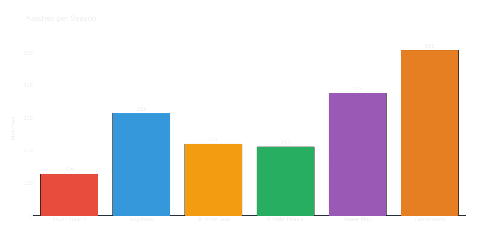
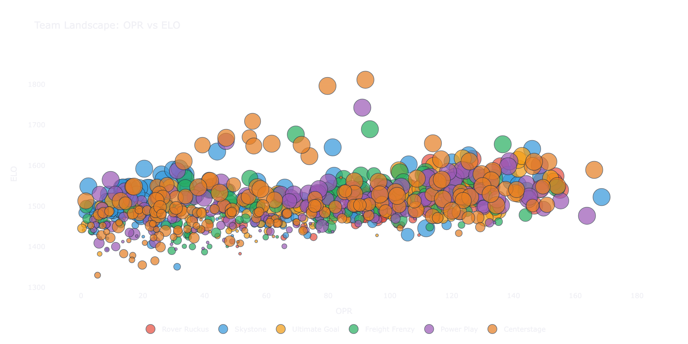
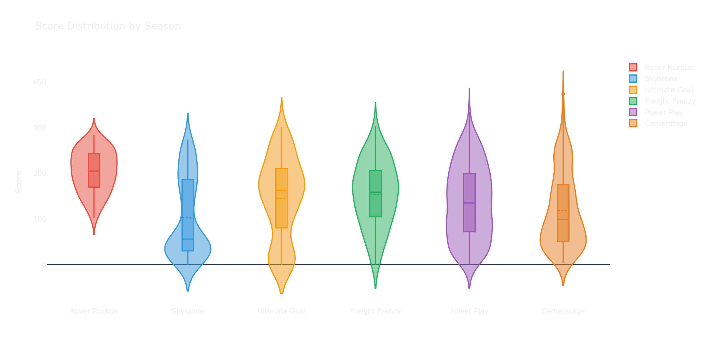
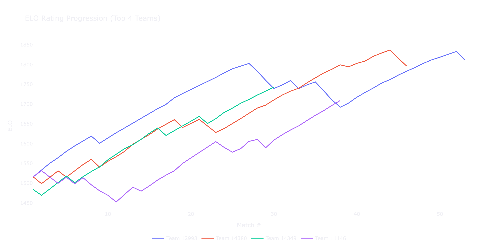
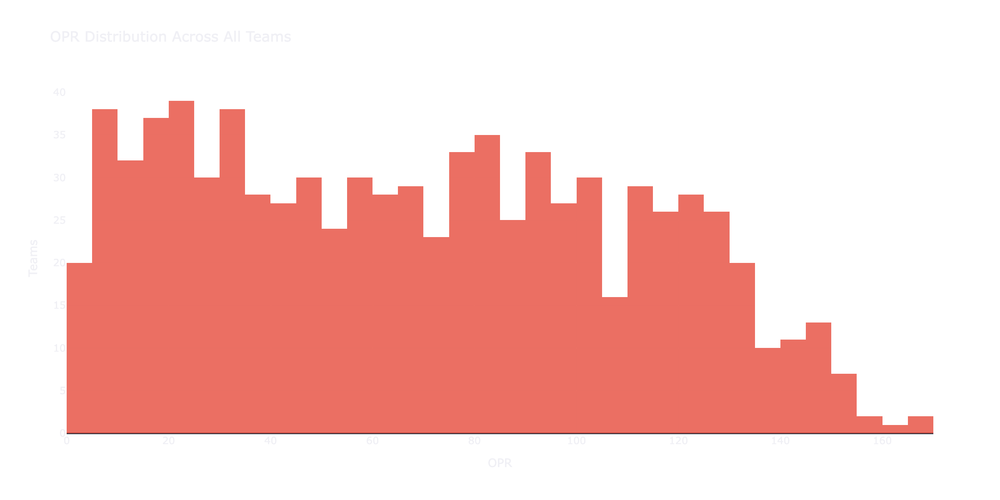

# FTC Open Analytics Dataset

A clean, structured, public dataset of FIRST Tech Challenge (FTC) match results spanning the 2018-19 through 2023-24 seasons, with computed performance metrics (OPR, CCWM, NP-OPR) and baseline machine learning benchmarks for match outcome prediction and playoff alliance strength estimation.

[](LICENSE)

## Dataset Statistics

| Metric | Value |
|:---|---:|
| Seasons Covered | 6 (1819–2324) |
| Events | 53 |
| Total Matches | 1,762 |
| Qualification Matches | 1,512 |
| Playoff Matches | 250 |
| Unique Teams | 902 |
| Unique Regions | 10 |
| Mean Score | 132.61 |
| Score Range | 0 – 374 |
| Mean OPR | 58.91 |

### Matches Per Season



| Season | Matches | Mean Score | Median Score | Std Dev |
|:---|---:|---:|---:|---:|
| 1819 (Rover Ruckus) | 129 | 201.13 | 205.00 | 45.03 |
| 1920 (Skystone) | 315 | 101.76 | 59.50 | 84.01 |
| 2021 (Ultimate Goal) | 221 | 148.92 | 167.00 | 90.03 |
| 2122 (Freight Frenzy) | 212 | 152.98 | 159.00 | 74.13 |
| 2223 (Power Play) | 377 | 136.27 | 133.00 | 78.96 |
| 2324 (Centerstage) | 508 | 116.04 | 96.00 | 81.22 |

## Data Schema

### `matches.csv` — One row per match

| Column | Type | Description |
|:---|:---|:---|
| `match_key` | String | Unique match identifier (e.g. `1819-TX-AUSTIN-Q1`) |
| `season` | String | FTC season identifier (`1819`–`2324`) |
| `event_key` | String | Event key string |
| `event_name` | String | Human-readable event name |
| `region` | String | Region code (e.g. `TX`) |
| `match_number` | Integer | Match number within the event |
| `red_team_1` | Integer | Red alliance team 1 number |
| `red_team_2` | Integer | Red alliance team 2 number |
| `blue_team_1` | Integer | Blue alliance team 1 number |
| `blue_team_2` | Integer | Blue alliance team 2 number |
| `red_score` | Integer | Final red alliance score |
| `blue_score` | Integer | Final blue alliance score |
| `score_diff` | Integer | Score difference (red − blue) |
| `winner` | String | Outcome: `red`, `blue`, or `tie` |
| `is_playoff` | Boolean | `True` for playoff/elimination matches |

### `teams.csv` — One row per team

| Column | Type | Description |
|:---|:---|:---|
| `team_number` | Integer | Unique FTC team number |
| `team_name` | String | Registered team name |
| `country` | String | Country of origin |
| `state_province` | String | State or province |
| `rookie_year` | Integer | First year the team competed |

### `team_events.csv` — One row per team per event

| Column | Type | Description |
|:---|:---|:---|
| `team_number` | Integer | Team number |
| `event_key` | String | Event identifier |
| `season` | String | Season identifier |
| `ranking` | Integer | Team rank at the event (by ranking points) |
| `wins` | Integer | Qualification match wins |
| `losses` | Integer | Qualification match losses |
| `ties` | Integer | Qualification match ties |
| `opr` | Float | Offensive Power Rating |
| `np_opr` | Float | Non-Penalty OPR |
| `ccwm` | Float | Calculated Contribution to Winning Margin |

### `team_elo.csv` — One row per team per match ELO update

| Column | Type | Description |
|:---|:---|:---|
| `team_number` | Integer | Team number |
| `season` | String | Season identifier |
| `event_key` | String | Event identifier |
| `match_number` | Integer | Match number in the event |
| `elo_before` | Float | ELO rating before the match |
| `elo_after` | Float | ELO rating after the match |
| `elo_change` | Float | ELO change from this match |

### Key Metrics

- **OPR (Offensive Power Rating):** Estimated points contributed by a team per match, solved via least squares regression on the alliance participation matrix.
- **NP-OPR (Non-Penalty OPR):** OPR computed after removing penalty points from scores.
- **CCWM (Calculated Contribution to Winning Margin):** Estimated margin contribution per team per match.
- **ELO Rating:** Rolling ELO rating (K=32, starting 1500) computed chronologically across all matches. Alliance-level outcomes used for 2v2 matches.

## Baseline Benchmarks

### Win Prediction (Season 2324 Test Set)

| Model | Accuracy | AUC-ROC | Brier Score | Log Loss |
|:---|---:|---:|---:|---:|
| OPR Difference Baseline | 0.8254 | 0.8979 | 0.1584 | 0.4905 |
| Logistic Regression | 0.8869 | 0.9412 | 0.0938 | 0.3086 |
| Gradient Boosted Trees | 0.7063 | 0.8159 | 0.1830 | 0.5456 |
| Random Forest (tuned) | 0.7103 | 0.8016 | 0.1955 | 0.5774 |
| XGBoost (tuned) | 0.8175 | 0.8611 | 0.1960 | 0.5813 |

*Hyperparameters tuned via GridSearchCV with TimeSeriesSplit. See `results/tuned_params.json`.*

### Alliance Strength Prediction

| Model | Pearson r | p-value | MAE | Top-1 Acc | Top-2 Acc |
|:---|---:|---:|---:|---:|---:|
| Naive OPR Sum | 0.2807 | 0.0483 | 1.3065 | 0.6154 | 0.8462 |
| Linear Regression | 0.3224 | 0.0224 | 1.0987 | 0.6154 | 0.9231 |

## 🚀 Interactive Dashboard



Launch the premium Streamlit dashboard to explore the dataset interactively:

```bash
cd ftc-analytics-dataset
streamlit run dashboard.py
```

**Or deploy to Streamlit Cloud** for a public URL (free):

1. Go to **[share.streamlit.io](https://share.streamlit.io)** and sign in with GitHub
2. Click **"New app"** → select repo `kaivalya-cyber/ftc-analytics-dataset`
3. Set **Main file path** to `dashboard.py`
4. Click **"Deploy!"**

The `.streamlit/config.toml` already sets the dark FTC theme.

The dashboard includes:
- **🏠 Home** — Dataset overview with season stats and score distributions
- **🔍 Team Explorer** — Search any team, view OPR/CCWM/ELO trends and event history
- **📅 Event Browser** — Browse match results and rankings for any event
- **🏆 OPR Leaderboard** — Top teams ranked by Offensive Power Rating
- **📈 ELO Ratings** — Rolling ELO leaderboard and per-team history tracker
- **🤝 Head-to-Head** — Compare any two teams' full match history, score timeline, and win/loss record
- **⚡ Upset Analysis** — Discover when underdogs win — upset rates by season, qual vs playoff, biggest upsets
- **🎯 Match Predictor** — 2v2 alliance prediction using OPR + ELO blended probability
- **🏆 Season Simulator** — Bracket tournament simulator — pick 8 teams, run Monte Carlo simulations
- **🥇 Player of the Season** — Composite power rankings (OPR + ELO + Win Rate) with season-end ELO accuracy
- **📊 Team Comparison** — Compare 2-4 teams side-by-side with radar charts, stat cards, and metric bar charts
- **🗺️ Team Landscape** — Interactive scatter plot of every team by OPR vs ELO, sized by win rate, colored by season

The dashboard features a **dark/light mode toggle** (🌙/☀️) in the sidebar, persisted across pages via session state.

The dashboard is a **multi-page Streamlit app** — pages live in `pages/` with shared utilities in `shared.py`.

### Score Distribution



### ELO Progression



### OPR Distribution



### Upset Statistics

| Split | OPR Upset Rate | ELO Upset Rate |
|:---|---:|---:|
| Overall | 20.9% | 16.5% |
| Qualification | 17.5% | 15.2% |
| Playoff | 40.8% | 24.4% |

*An "upset" is when the predicted favorite (by summed OPR or average ELO) loses. Playoffs have 2.3× more upsets than qualifications.*

## 🌐 Streamlit Cloud Deployment

To deploy the dashboard publicly (free tier):

1. Go to **[share.streamlit.io](https://share.streamlit.io)** → sign in with GitHub
2. Click **"New app"**
3. Select repo: `kaivalya-cyber/ftc-analytics-dataset`
4. Branch: `main`, Main file path: `dashboard.py`
5. Click **"Deploy!"**

Configuration (`.streamlit/config.toml`) is already committed with the dark FTC theme.

## Quick Start

### Prerequisites

- Python 3.9+
- Packages: `numpy`, `pandas`, `scipy`, `scikit-learn`, `requests`, `tqdm`, `python-dotenv`, `jupyter`, `streamlit`, `matplotlib`, `seaborn`

### Installation

```bash
git clone https://github.com/kaivalya-cyber/ftc-analytics-dataset.git
cd ftc-analytics-dataset
pip install -r requirements.txt
```

Streamlit Cloud is the easiest way to deploy.

1. Go to **[share.streamlit.io](https://share.streamlit.io)** and sign in with GitHub
2. Click **"New app"** → select repo `kaivalya-cyber/ftc-analytics-dataset`
3. Set **Main file path** to `dashboard.py`
4. Click **"Deploy!"**

The `.streamlit/config.toml` already sets the dark FTC theme.

### Running the Pipeline

The dataset ships with pre-generated mock data (no API keys needed). Run the pipeline sequentially:

```bash
# 1. Collect raw data (mock mode by default)
python scripts/collect_toa.py
python scripts/collect_ftc_events.py

# 2. Build cleaned dataset
python scripts/build_dataset.py

# 3. Compute OPR, CCWM, NP-OPR
python scripts/compute_opr.py

# 4. Compute ELO ratings
python scripts/compute_elo.py

# 5. Run benchmarks
python scripts/benchmark_win_prediction.py
python scripts/benchmark_alliance_strength.py

# Optional: Launch the exploration notebook or dashboard
jupyter notebook exploration.ipynb
streamlit run dashboard.py
```

### Using Real API Data

Copy `.env.example` to `.env` and fill in your API keys:

```bash
cp .env.example .env
# Edit .env with your TOA_API_KEY and FTC_EVENTS_API_KEY
```

With valid API keys, the collection scripts will fetch live data from The Orange Alliance and FIRST FTC Events APIs.

## Repository Structure

```
ftc-analytics-dataset/
├── data/
│   ├── raw/
│   │   ├── toa/           # Raw JSON from The Orange Alliance API
│   │   └── ftc_events/    # Raw JSON from FTC Events API
│   └── processed/
│       ├── matches.csv    # Canonical match data
│       ├── teams.csv      # Canonical team data
│       └── team_events.csv # Team-event stats with OPR
├── scripts/
│   ├── collect_toa.py
│   ├── collect_ftc_events.py
│   ├── build_dataset.py
│   ├── compute_opr.py
│   ├── compute_elo.py       # Rolling ELO rating computation
│   ├── benchmark_win_prediction.py
│   └── benchmark_alliance_strength.py
├── results/
│   ├── win_prediction_benchmark.csv
│   └── alliance_strength_benchmark.csv
├── dashboard.py           # Streamlit entry point (Home page)
├── shared.py              # Shared utilities (cached data, CSS, lookups)
├── images/                # Dashboard screenshots for README
├── pages/                 # Multi-page Streamlit app pages
│   ├── 02_🔍_Team_Explorer.py
│   ├── 03_📅_Event_Browser.py
│   ├── 04_🏆_OPR_Leaderboard.py
│   ├── 05_📈_ELO_Ratings.py
│   ├── 06_🤝_Head_to_Head.py
│   ├── 07_⚡_Upset_Analysis.py
│   ├── 08_🎯_Match_Predictor.py
│   ├── 09_🏆_Season_Simulator.py
│   ├── 10_🥇_Player_of_the_Season.py
│   ├── 11_📊_Team_Comparison.py
│   └── 12_🗺️_Team_Landscape.py
├── kaggle-metadata.json   # Kaggle dataset publishing metadata
├── exploration.ipynb
├── dataset_description.md
├── LICENSE
└── README.md
```

## Citation

If you use this dataset in your research, please cite:

```bibtex
@misc{singh2025ftc,
  author       = {Kaivalya Singh},
  title        = {{FTC Open Analytics Dataset}},
  year         = {2026},
  howpublished = {\url{https://github.com/kaivalya-cyber/ftc-analytics-dataset}},
  note         = {FIRST Tech Challenge match data (2018-19 to 2023-24) with OPR metrics and ML benchmarks}
}
```

## License

This project is licensed under the MIT License — see the [LICENSE](LICENSE) file for details.

Data sourced from [The Orange Alliance](https://theorangealliance.org) and [FIRST FTC Events API](https://ftc-events.firstinspires.org/services/API).

## Publishing to Kaggle / Hugging Face

### Kaggle
```bash
# Install Kaggle CLI and authenticate
pip install kaggle
kaggle auth login          # Opens browser for OAuth
# Or: export KAGGLE_USERNAME=... KAGGLE_KEY=...
kaggle datasets create -p . --dir-mode skip
```
The `kaggle-metadata.json` is already configured. Update the `id` field with your Kaggle username.

### Hugging Face
```bash
pip install huggingface_hub
huggingface-cli login
# Upload dataset
data/processed/*.csv to a Hugging Face dataset repo
```
